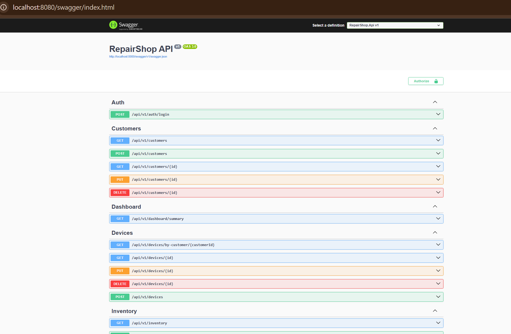
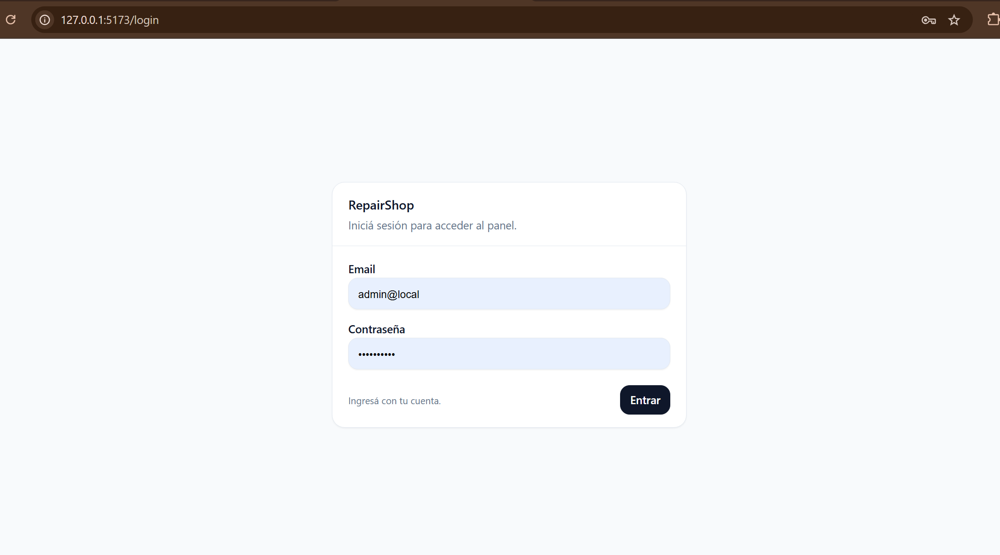
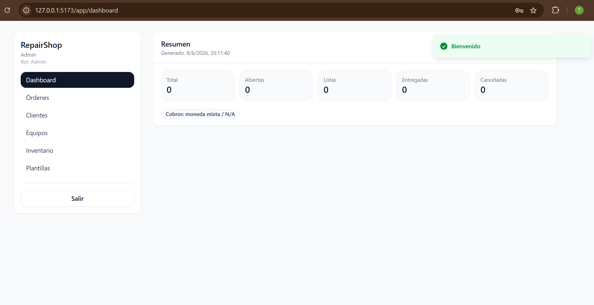
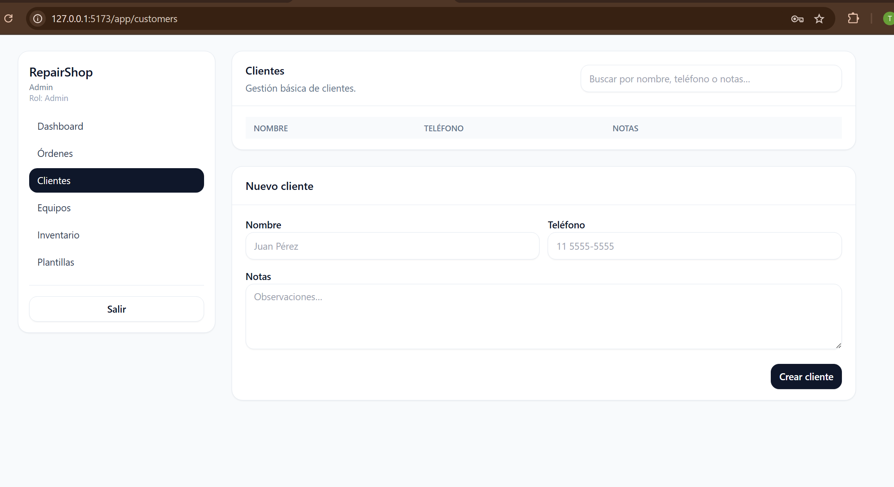
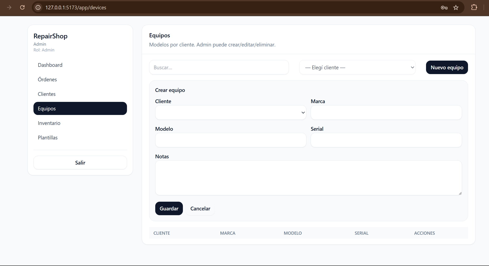
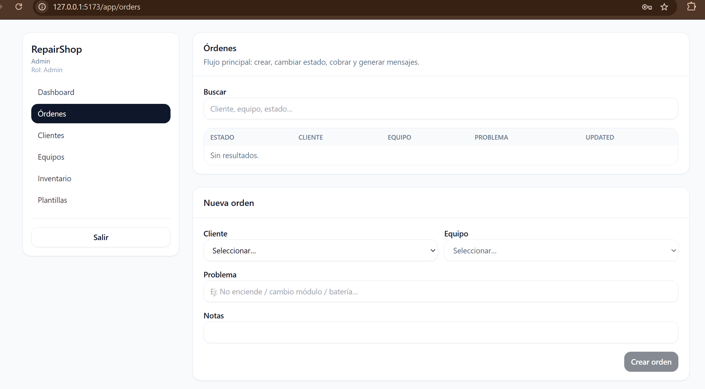
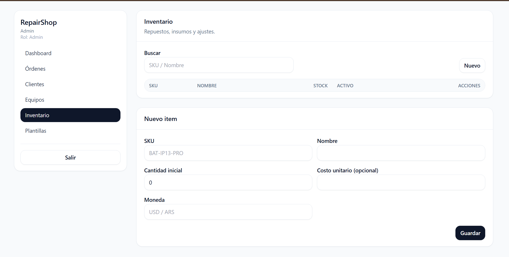

# RepairShop Management System

Full-stack internal management system for repair shops to manage customers, devices, repair orders, inventory, payments, status history and message templates.

This project is built as a real business-oriented application, not a generic CRUD demo. It shows how a repair shop can organize its daily workflow from customer intake to repair tracking, inventory usage and operational follow-up.

## Problem

Small repair shops often manage customers, devices, repair orders and payments using WhatsApp chats, paper notes or spreadsheets. This creates several problems:

- Repair orders are hard to track.
- Customer and device information gets duplicated or lost.
- Status changes are not clearly recorded.
- Inventory usage is disconnected from each repair.
- Message templates and follow-ups are handled manually.
- There is no centralized dashboard for daily operations.

## Solution

RepairShop Management System centralizes the repair workflow in a web application with a structured backend API and a React frontend.

The system allows a repair shop to:

- Register customers.
- Register customer devices.
- Create and manage repair orders.
- Track repair order status changes.
- Manage inventory items and parts usage.
- Register payments.
- Use message templates for customer updates.
- View operational data from a dashboard.
- Protect access with authentication and roles.

## Features

- JWT-based authentication.
- Role-based access structure.
- Customer management.
- Device management.
- Repair order creation and tracking.
- Repair order status workflow.
- Order notes and status history.
- Inventory management.
- Parts usage tracking.
- Payment registration.
- Message templates.
- Dashboard summary.
- API health checks.
- Docker Compose setup for API and PostgreSQL.
- Backend tests.

## Tech Stack

### Backend

- .NET 8 Web API
- C#
- Entity Framework Core
- PostgreSQL
- JWT Authentication
- Docker Compose
- xUnit
- Clean Architecture style structure

### Frontend

- React
- Vite
- TypeScript
- Tailwind CSS
- Axios / API client layer

### Infrastructure

- Docker
- PostgreSQL
- Swagger / OpenAPI
- Health checks

## Architecture

The backend is organized in layered projects:

```txt
backend/
  src/
    RepairShop.Api             # HTTP API, controllers, auth, middleware, Swagger
    RepairShop.Application     # Use cases, contracts, services, abstractions
    RepairShop.Domain          # Business entities and domain rules
    RepairShop.Infrastructure  # Persistence, repositories, EF Core, security
  tests/
    RepairShop.Application.Tests
    RepairShop.Domain.Tests
```

The frontend is organized as a React application:

```txt
frontend/
  src/
    api/          # API client and request types
    auth/         # Authentication state and JWT handling
    components/   # Shared UI components
    pages/        # Business pages: dashboard, orders, customers, devices, inventory
```

Main flow:

```txt
User -> React Frontend -> .NET API -> Application Layer -> Domain Layer -> PostgreSQL
```

## Screenshots

Current screenshots in `docs/screenshots/`:

- Swagger API
- Login
- Dashboard
- Customers
- Devices
- Orders
- Inventory















## Getting Started

### Requirements

- .NET 8 SDK
- Node.js
- npm
- Docker Desktop

## Run the Backend

From the backend folder:

```txt
cd backend
dotnet restore
dotnet build
dotnet test
```

To start the API with PostgreSQL using Docker Compose:

```txt
docker compose -f docker-compose.yml -f docker-compose.dev.yml up --build
```

API endpoints:

```txt
API:     http://localhost:8080
Health:  http://localhost:8080/healthz
Ready:   http://localhost:8080/readyz
Swagger: http://localhost:8080/swagger
```

## Run the Frontend

From the frontend folder:

```txt
cd frontend
npm install
npm run dev -- --host 127.0.0.1
```

Frontend URL:

```txt
http://127.0.0.1:5173
```

## Seed Login

Development-only seed user:

```txt
Email:    admin@local
Password: Admin12345
```

This user is intended only for local development and demo purposes.

## Environment Variables

This repository includes example configuration files only.

Root example:

```txt
.env.example
```

Backend examples:

```txt
backend/.env.example
backend/src/RepairShop.Api/appsettings.Example.json
```

Frontend examples:

```txt
frontend/.env.example
frontend/.env.production.example
```

Do not commit real secrets, local database passwords or production JWT keys.

## Validation Status

Current validation status:

```txt
Backend restore: OK
Backend build: OK
Backend tests: OK
Tests passing: 8
Docker API + PostgreSQL: OK
GET /healthz: 200
GET /readyz: 200
GET /swagger: 200
Frontend dev server: OK
Frontend login through proxy: OK
Seed admin login: OK
```

The current version builds successfully, passes backend tests and runs locally with Docker, PostgreSQL and the React frontend.

## Business Value

This project demonstrates how internal software can reduce operational disorder in a repair shop.

Instead of tracking repairs manually through chats or spreadsheets, the shop gets a structured system for:

- Customer records.
- Device records.
- Repair order tracking.
- Status history.
- Inventory usage.
- Payments.
- Message templates.
- Operational visibility.

This project can be adapted for businesses that need to organize service orders, track operational workflows and reduce manual administrative work.

## Project Status

Portfolio-ready base version.

The current version includes a working backend, frontend, PostgreSQL setup, Docker Compose configuration, authentication, business entities and automated backend tests.

Next improvements:

- Add screenshots to docs/screenshots.
- Record a 60-90 second demo video.
- Add deployment instructions.
- Review dependency warnings.
- Improve nullable warnings.
- Add more end-to-end tests.
