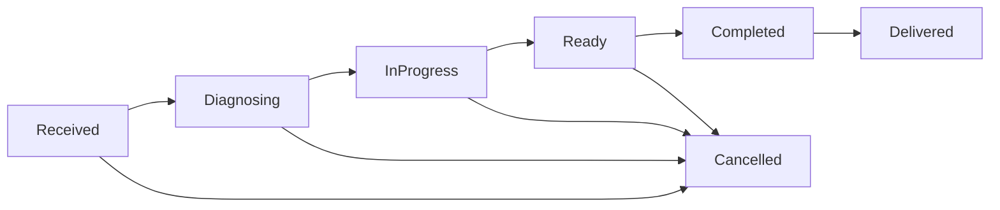

# State machine de Órdenes

Este documento describe los **estados**, **transiciones permitidas** y **reglas** que el backend aplica para una orden (`RepairOrder`).

> Fuente de verdad: dominio (`RepairOrder.MoveTo`). El frontend solo refleja lo que el backend permite.

## Estados

- `Received` (0) — ingresó al sistema (recepción).
- `Diagnosing` (1) — diagnóstico en curso.
- `InProgress` (2) — reparación/trabajo en curso.
- `Ready` (3) — lista para finalizar/cerrar.
- `Completed` (4) — finalizada (lista para entregar).
- `Delivered` (5) — entregada.
- `Cancelled` (6) — cancelada.

## Diagrama

## Transiciones permitidas

| From | To (permitidos) |
|---|---|
| `Received` | `Diagnosing`, `Cancelled` |
| `Diagnosing` | `InProgress`, `Cancelled` |
| `InProgress` | `Ready`, `Cancelled` |
| `Ready` | `Completed`, `Cancelled` |
| `Completed` | `Delivered` |
| `Delivered` | *(ninguna)* |
| `Cancelled` | *(ninguna)* |

## Reglas operativas

1. **No hay saltos**: no podés ir `Received → InProgress` ni `Diagnosing → Ready`, etc.
2. **Cancelación**: solo es posible hasta `Ready` (inclusive). Una vez `Completed`, solo `Delivered`.
3. **Auditoría**: cada cambio de estado genera un evento de auditoría con `from/to` y `actor`.
4. **Side-effects** (best-effort): el cambio de estado persiste y luego se intenta generar outbox/preview; si el side-effect falla no debería revertir el cambio (para evitar bloqueos operativos).

## Cómo diagnosticar errores al cambiar de estado

- Si el backend devuelve **400**: casi siempre es **regla de transición** (estado inválido) o **payload inválido**.
- Si devuelve **500**: es un bug o fallo en un side-effect. Revisá logs del request (correlation-id) y la excepción.
